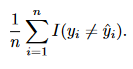
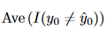
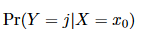
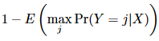
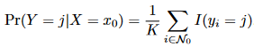

# Statistical Learning

## What is Statistical Learning?

- input variable = predictor = independent variable = feature; denoted with *X*
    - number of predictors is indicated using *p*
    - *n* = number of observations
- output variable = response = dependent variable; denoted with *Y*
- error term $\epsilon$ = variable value which is added to a function describing the relation between *X* and *Y* and which averages to 0; the variable itself may change depending on the input data
    - ex. *Y* = *f*(*X*) + $\epsilon$
    - goal is to estimate function *f* using known observations
    - statistical learning = estimating *f*

### Why Estimate *f*?

2 reasons:
    1. prediction
    2. inference

#### Prediction

- $\hat{Y}$ = $\hat{f}$(*X*)
    - $\hat{Y}$ is the predicted response
    - $\hat{f}$ is the predicted function
    - $\hat{Y}$'s accuracy is dependent upon 2 variables:
        1. reducible error - error that is introduced by having an imperfect estimate of *f*
        2. irreducible error - error that is introduced by $\epsilon$; this error may arise from missing predictors or unquantifiable variations
            - the upper bound on prediction accuracy
            - value is unknown in practice

#### Inference

- if our goal is to determine the relationship between *X* and *Y*, then *f* cannot be treated as a black box- its form must be known because we are not interested in $\hat{Y}$
- the following questions may be asked in this case:
    - which predictors effect *Y*?
    - how do relevant predictors effect *Y*?
    - is the relationship between relevant predictors and *Y* linear or more complicated?
- linear models make it easier to interpret relationships between predictors and responses
- nonlinear models often make more accurate predictions based on inputs, but make interpretation of relationships more difficult (more black box approach)

### How Do We Estimate *f*?

- all models require a set of *n* inputs (training data)
- *$x_{ij}$* = value of *j*th predictor of *i*th observation
- *$y_{i}$* = value of *i*th prediction
- goal is to find $\hat{f}$ that most accurately predicts *Y*; methods for this can broadly be defined as parametric or non-parametric

#### Parametric Methods

- 2-step model-based approach:
    1. assume shape/form of the relationship
        - ex. relationship is linear, which simply means that coefficients applied to predictors must be manipulated to find $\hat{f}$
    2. follow procedure to fit/train the model to reflect the assumed relationship
        - least squares is the most common method for a linear model, but many others exist
- reduces the effort of modeling down to selecting the right coefficients
- advantages:
    - easier to fit coefficients to a known (or assumed) relationship than it is to try to determine the relation based on limited data
        - trying to determine the form using limited data will often lead to overfitting, where the model is too closely trained to the $\epsilon$ of the training data
- disadvantages:
    - if our assumption about the form is incorrect, then resultant estimates will be low quality
- with limited data, a parametric approach is often the best option

#### Non-Parametric Methods

- makes no assumptions about the form of *f*
- requires much more data to achieve an accurate estimate than does the parametric method
    - overfitting is extremely likely with low quantities of observations; new observations will likely not be predicted accurately by these models in this case

### The Trade-Off Between Prediction Accuracy and Model Interpretability 

- As model flexibility increases, interpretability decreases
- If you need to determine the relationship between predictors and responses (e.g. how television advertisements affect voter sentiment) then using a highly inflexible model would make sense
    - conversely, if you only need to make predictions, then it doesn't really matter whether you understand the relationship, so a more flexible model (assuming sufficient input) would be better

### Supervised Versus Unsupervised Learning

- supervised learning involves both an input and an output
- unsupervised learning focuses on understanding the relationships between various predictors
- semi-supervised learning is a combination of the two that occurs when only a subset of responses for observations are available (e.g. when collecting responses is more costly than collecting observations)

### Regression Versus Classification Problems

- problems that involve quantitative responses are regression problems
- problems with qualitative responses are classification problems
    - most stat learning methods can be applied to a situation so long as their predictors are properly coded
- some overlap may exist especially when data have binary classes

## Assessing Model Accuracy

- there is no single greatest model, different models will perform better on different data sets

### Measuring the Quality of Fit

- each predicted response in a supervised model must be evaluated in terms of its accuracy relative to the actual response
    - common mechanism used for this is *Mean Squared Error* (MSE)
    - 
    - when a model is good/accurate, the MSE will be small
- the accuracy of the model relative to the training data is unimportant- if it was, then models would be optimized to fit data rather than their underlying patterns
    - test data is used to assess accuracy
    - prediction accuracy against training data is not necessarily indicative of accuracy against test data
- training MSE will decrease with greater model flexibility
    - when a less flexible model would have yielded a lower test MSE, we see overfitting in action

### The Bias-Variance Trade-Off

- expected test MSE can be decomposed into the sum of 3 values:
    1. variance of f-hat
    2. squared bias of f-hat
    3. variance of $\epsilon$
- 
    - the overall expected test MSE can be determined by averaging the result of this equation across all test values
    - to minimize expected test error, lower *bias* **AND** lower *variance*
- variance = how different f-hat would be if a different training set was used
    - higher variance typically results from higher flexibility
    - ideally, different training sets should yield the same f-hat
- bias = error resulting from attempting make a prediction about a complicated phenomenon using an overly simplistic model
    - more flexible models result in lower bias
- when determining the flexibility of a model, we want to find a balance between bias and variance that lowers the test MSE
    - the rates of change of bias and variance relative to model flexibility are not the same, which is what makes a single optimal balance possible
- finding a balance to this trade-off is a central goal in statistical learning problems
- explicit computation of test MSE isn't practically possible because the true value of *f* is virtually never known

### The Classification Setting

- while regression models focus on average error size, classification problems use error rate
- 
    - *I($y_{i}$ != $\hat{y}_{i}$)* is the indicator variable
        - if true then equal to 1; i.e. if our prediction was wrong
        - else equal to 0
    - training error rate
- 
    - test error rate
    - good classifiers minimize this value

#### The Bayes Classifier

- somewhat intuitively, the test error rate (shown above) is minimized when we simply assign each observation to its most likely class given its predictor values
- 
    - probability that our prediction, *Y* is set to class *j* given observation *$x_{0}$*
    - if this value is greater than any other alternative class, then this is the prediction
        - ex. in a 3 class model, where class 1 has probability of .4, class 2 .3, and class 3 .3, then class 1 would be the predicted class
- 
    - bayes classifier error rate
    - probability that our predicted class is incorrect
    - only achievable by a perfectly optimal classifier; irreducible error

#### K-Nearest Neighbors

- in practice, the Bayes classfier cannot be computed
    - conditional distribution of *Y* given *X* cannot be known in practice
- K-nearest neighbors (KNN) classifier attempts to estimate conditional distribution of *Y* and assign classes based on the highest *estimated* probability (in contrast to Bayes which assigns classes based on highest actual probability)
    - KNN classifier takes a positive integer K (which the modeler determines through intuition, guesswork, and/or iteration), collects a set of K points from its training data (this set is represented by *$N_{0}$*), and estimates the probability of point *$x_{0}$* being a member of class *j* as a fraction of points in *$N_{0}$* that also in class *j* 
- 
- size of K greatly impacts model accuracy
    - larger values have high variance, low bias, and vice versa
    - more info on setting K to come; general suggestion: make K equal to square of the number of features
