# Linear Regression

- supervised learning mecahnism for predicting quantitative response

## Simple Linear Regression

- predict quantitative result *Y* using a single predictor *X*
- assumes a roughly linear relationship between *Y* and *X*
- 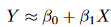
    - "we are regressing *Y* onto *X*"
    - 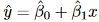
        - estimation for a single instance
    - in this equation we're just trying to find the values of slope and intercept

### Estimating the Coefficients

- given a set of training predictors and outcomes, we aim to estimate the values of $\hat{\beta}_{0}$ and $\hat{\beta}_{1}$- the intercept and slope, respectively
- least squares = the most common mechanism for measuring *closeness*
- residual = difference between *i*th observed and predicted response
- residual sum of squares (RSS) = measure of fitness for a model to a set of data
    - 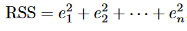
    - 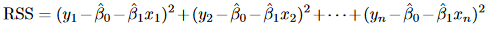
    - optimal models minimize the RSS
---
## THIS HERE IS IMPORTANT ##

- 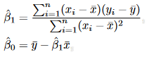
- the above are the equations for estimating least squares coefficients
- $\bar{x}$ and $\bar{y}$ are the sample means
---
### Assessing the Accuracy of the Coefficient Estimates

- if *f* can be approximated by a linear function, it takes the form: 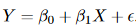
    - error term may be "working harder" in some instances based on the true form of *f*
- population regression line = closest estimation of *Y* relative to *X*
    - unobserved in practice; always the same for a given problem space
- least squares line = $\hat{y}$; or predicted set of values
    - based upon training data, thus differs between training sets
- the average of least squares lines across all possible samples will be exactly equal to the population regression line
    - this property aligns with the lack of bias in the method
    - while the average will eventually align, any given least squares line may be a great over/underestimate of the population regression line -> **Standard Error**
- standard error = average amount by which an estimate differs from its actual value
    - 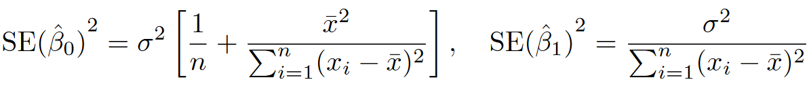
    - $\sigma$ = standard deviation of each $y_{i}$
        - not known, but can be estimated from data
        - residual standard error (RSE) = estimate of $\sigma$; 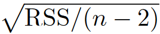
    - used to compute confidence intervals
        - confidence interval = range in which we can assign a certain probability that true value will be contained within
- hypothesis test = binary test between a null hypothesis and an alternative hypothesis
    - ex. $H_{0}$: there is no relationship between *X* and *Y*; $H_{a}$: there is some relationship between *X* and *Y*
        - in effect, with regard to linear regression, we're asking is $\beta_{1}$ equal to 0
    - practically, *t-statistic* is calculated to determine the ratio of standard error to our estimated value's difference from our null hypothesis value
        - i.e. t-stat = how many times our standard error is the difference between our estimate and our null hypothesis value
        - using the t-stat, we can calculate the p-value
            - p-value = correlatory value that suggests whether we should reject/accept our null hypothesis
        - 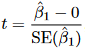

### Assessing the Accuracy of the Model

- quality of fit for a linear regression model is determined using 2 related values:
    - residual standard error (RSE)
    - $R^{2}$ statistic

#### Residual Standard Error

- RSE = estimate of standard deviation of $\epsilon$; measure of *lack* of model fit- higher values = lower fit
    - measured in units
- 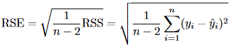
    - 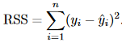

#### $R^{2}$ Statistic

- measured as a proportion between 0 and 1
    - independent of scale
- 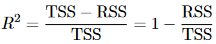
    - TSS = total sum of squares; amount of variability in *Y*; 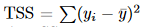
    - RSS = unexplained variability within linear regression model
- $R^{2}$ = how much variability in *Y* that is explained by *X*
    - higher values mean that more variation is explained by the regression
- correlation = 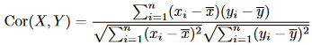
    - squared correlation and $R^{2}$ statistic are identical in simple linear regression models
    - correlation is not exactly useful in complex settings because it is limited to comparing a set of just two variables -> this is the importance of the $R^{2}$ statistic

## Multiple Linear Regression

- when trying to predict a value on the basis of multiple input features and using linear regression, a single unified model must be created to simultaneously utilize the effects of all input features
- 

### Estimating the Regression Coefficients

- as was the case with simple linear regression, we're trying to estimate the coefficients for the above equation 
- again, we attempt to estimate coefficients with the goal of minimizing the RSS sum
    - 
    - coefficient estimates best lend themselves to matrix representations
        - graphical representations become nearly impossible once more than two predictors are used
- the introduction of additional *relevant* factors can challenge some assertions based on simple linear regression as correlatory vs causative predictors can often be separated

### Some Important Questions

#### One: Is there a relationship between the response and predictors?

- In a simple linear regression model we simply must ask if our single slope value, $\beta_{1}$, is equal to zero; extending that to apply to a multiple regression model, we ask if $\beta_{1}$ = $\beta_{2}$ = ... = $\beta_{p}$ = 0
    - this becomes our $H_{0}$ in hypothesis testing- that there is no relationship between predictors and response, that is
    - $H_{a}$ = at least one coefficient is non-zero
    - these hypotheses are tested by computing the F-statistic
        - 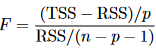
            - 
            - 
        - when $H_{0}$ is true, then the F-statistic will approach 1, the numerator and denominator will both approach standard deviation squared
            - if the RSS (our measure of error) is less when our coefficients are *not* all set to 0, then we know that there is some relationship between response and predictors
        - the further from 1 our F-stat is, the more confident we can be in the presence of some relationship
            - the larger our number of observations (*n*), the lower our F-stat must be in order to prove that $H_{0}$ is false
- one could theoretically perform a t-stat test on each predictor separately to determine which actually influence the result
    - this flawed for the following reasons:
        - when a large number of predictors is present, each one may have only a very small effect on the response, but their total impact may be very important
        - some predictors may have small p-values by chance- this is even more likely in a model with many predictors
    - when p > n, we cannot use this t-stat or F-stat

#### Two: Deciding on Important Variables

- variable selection = the process of determining which predictors are relevant to the response
    - as discussed above, simply evaluating individual p-values for each var will likely lead to incorrect conclusions if the number of predictors is sufficiently large
    - the process of variable selection is discussed at length in [Chapter 6](./6-Linear-Model-Selection-and-Regularization.md)
- our ideal method of selection would be to test each possible combination of predictors in the model
    - this is obviously impractical once our number of predictors is even modestly large as the size grows at a rate of $2^{n}$
    - 3 classical alternatives exist:
        1. forward selection: we begin with the null model (from $H_{0}$- intercept only), we then try *p* simple linear regression models and add to our null model the variable whose model results in the lowest RSS.  We iterate on this model and recalculate a new set of *p* multiple linear regression models that contain an intercept, our lowest-RSS model param and one of the remaining params.  We continue this until a pre-determined stop condition is reached.
        2. backward selection: We start with a model containing all *p* predictors, and remove the predictor with the largest p-value.  We iterate and continue until a pre-determined stop condition is reached
            - cannot be used if *p* > *n*
        3. mixed selection: we start with a model with no predictors and add only those that provide best fit, if a predictors has too high a p-value, then it is not added.  Iterate through all possible predictors; the end.
- there exist various methods for determining model quality; some are listed here, but will not be explained until Chapter 6
    - Mallow's $C_{p}$
    - Akaike information criterion (AIC)
    - Bayesian infromation criterion (BIC)
    - adjusted $R^{2}$

#### Three: Model Fit

- RSE and $R^{2}$ are two of the most common measures of model fit
    - $R^{2}$ = Cor($Y$, $\hat{Y}$)$^2$
        - square of correlation between response and fitted linear model
- there is a small increase in $R^{2}$ whenever additional predictors are added; this occurs almost completely independently of any relationship that they may or may not have with the response
    - the RSE decreases as well since it is partly based on the number of parameters included
        - if the increase to RSS is small, then the increase in parameters will naturally decrease the RSE
        - 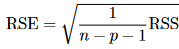
- visual representations often help identify problems with models that simple numerical analysis has missed

#### Four: Predictions

- 3 types of uncertainty exist for multiple linear regression models:
    1. coefficient estimates are only estimates- they have irreducible error and practically will virtually always have reducible error left in them as well
    2. model bias arising from our selection of a linear model as the basis of our prediction.
    3. irreducible error is always present even when we know f(X)
- confidence intervals aim to quantify the uncertainty

## Other Considerations in the Regression Model

### Qualitative Predictors

- so far only considered quantitative predictors have been considered in example models, but what if...

#### Predictors with Only Two Levels

- 